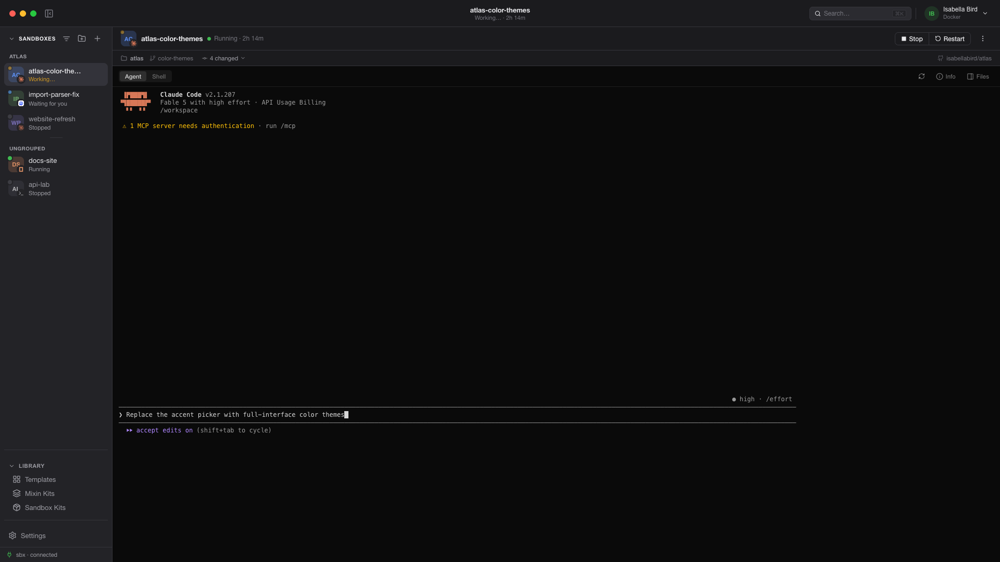

<div align="center">


# den · Developer Ephemeral Node

**Spin up ephemeral coding environments where AI builds your apps.**

[useden.ai](https://useden.ai)

den is a beautiful desktop GUI for [Docker Sandboxes](https://docs.docker.com/ai/sandboxes/) (the `sbx` CLI). Launch disposable, isolated environments, point an AI agent (Claude Code, Codex, Cursor, Gemini, …) at a workspace, and let it build, run, and iterate on apps — then throw the sandbox away when you're done. All without living in the terminal.

<br />



</div>

---

## What it does

den wraps the `sbx` CLI in a native macOS/Windows app:

- **Sandboxes** — create, run, stop, and delete agent sandboxes. Pick any agent (Claude, Codex, Cursor, Gemini, Copilot, Droid, …), a workspace, optional memory and Git‑clone isolation, and a random cosmic name. Watch live progress while a sandbox is created.
- **Agent & Shell terminals** — full‑screen agent TUIs (e.g. Claude Code) and an interactive shell, rendered with **xterm.js** over a real PTY.
- **Files** — browse the sandbox workspace, open/edit files in a dedicated editor window, and see the agent's **changes inline** (live `git status` badges).
- **Groups** — organize sandboxes into named groups. Drag to reorder within a group or move a sandbox to another group (an insertion line marks a reorder; a highlighted group marks a move — no modifier keys). Start or stop every sandbox in a group at once, or delete the group (optionally with its sandboxes). Give each sandbox its own **color + icon** so you can tell them apart at a glance.
- **Network policy** — see exactly which domains a sandbox can reach, add allow rules from the UI, and get a clear warning when an org governance profile is overriding local rules.
- **Secrets** — manage `sbx` service credentials (Anthropic, OpenAI, Google, GitHub, …) with OAuth where supported, or source a value straight from **1Password** — paste an `op://Vault/Item/field` reference and den resolves it via the `op` CLI, so the real value never lives in den.
- **Templates & Runtime** — list/launch/delete template images; check the `sbx` version, view release notes, and update in place. See whether you're signed in to the runtime and re‑authenticate in a click.
- **Logs** — live‑tail the `sbx` daemon logs, or read a specific sandbox's kit‑startup log.
- **Theming** — light / dark / system, custom accent colors that retint the whole UI, and a terminal theme that can follow the app's light/dark mode or be set independently.
- **Stay awake** — optionally prevent system sleep while any sandbox is running, so long agent runs aren't interrupted (toggle in Settings).
- **Keyboard‑driven** — ⌘N new · ⌘S stop · ⌘R restart · ⌘L logs · ⌘F files · ⌘I info · ⌘X delete, plus a menu‑bar app for quick access to running sandboxes and groups from the tray.

## Git workflow

den keeps your working tree safe and makes it easy to get an agent's work back onto your machine:

- **Clone isolation** — create a sandbox with `--clone` and the agent works on a private, in‑container clone of your repo; your host workspace is mounted read‑only, so nothing the agent does touches your files directly. A `sandbox-<name>` git remote links the two.
- **Live changes** — see what the agent created or changed via `git status` run inside the sandbox (the **Changes** tab), with inline status badges. Works for both mounted and cloned workspaces.
- **Git context at a glance** — each sandbox's header condenses its folder, branch, uncommitted‑change count, and a link to the GitHub remote into one line.
- **Bring the work home** — from a sandbox's menu, **Feature changes ▸ Merge changes to your repo**: den fetches the sandbox's branch into your host repo, then either **opens a pull request** (when the repo has a remote — it pushes and creates the PR) or **merges** it into your current branch. Pick **Merge, then delete** to finish and discard the sandbox in one step. Nothing lands without a confirmation.

## Kits — compose & share agent setups

Kits are declarative add‑ons (`sbx` artifacts) that layer tools, MCPs, network rules, env vars, agent memory, and startup commands onto an agent. den makes them first‑class:

- **Visual composer** — build a kit from a form (no YAML): add capabilities from a dropdown — **Remote MCPs**, network policies, env variables, agent memory (attach PDFs/MD/txt), and commands.
- **Remote‑MCP catalog** — 50+ hosted MCP servers (GitHub, Linear, Notion, Figma, Sentry, Supabase, …) with icons, search, and category filters; or add a **Custom MCP** by URL. Each becomes a one‑click allow rule + registration.
- **Mixin vs Sandbox kits** — stack several *mixin* kits onto an agent, or define a full agent from a base image with a *sandbox* kit.
- **Add anywhere** — attach kits at sandbox creation, or inject them into a running sandbox; the kits applied to a sandbox show in its info panel.
- **Share via any OCI registry** — push a kit to Docker Hub / ghcr (`sbx kit push`) straight from the row's menu, with the reference prefilled from your logged‑in Docker account. Pull a friend's kit by reference — import it into your library or attach it at creation, no download step.

## Requirements

- macOS or Windows
- [Docker](https://www.docker.com/) running
- The **`sbx`** CLI installed and signed in:
  ```bash
  brew install docker/tap/sbx   # macOS
  sbx login
  ```

## Troubleshooting

Hitting an error? See the [FAQ & Troubleshooting guide](docs/faq.md) — it starts
with known problems (like the `sbx` daemon "another daemon is already running"
race) and their fixes.

## Development

Use Node.js 26.5.0 (see `.nvmrc`) and npm 12.0.1. Node Current is required for reproducible development and CI.

```bash
npm install
npm run dev        # launch the app with hot reload (electron-vite)
```

> Renderer changes hot‑reload; main/preload changes take effect on a full relaunch.

## Build

```bash
npm run build      # type-check + bundle
npm run build:mac  # package a macOS app
npm run build:win  # package a Windows app
```

## Tech stack

Electron · React · TypeScript · electron‑vite · Zustand · xterm.js · lucide‑react · @lobehub/icons · @basiclines/rampa‑sdk (palette generation)

## Project layout

```
src/
  main/      # Electron main: sbx wrapper, PTYs, IPC, tray, window
  preload/   # contextBridge API surface
  renderer/  # React app (components, store, styles)
```

---

<div align="center">
<sub>Not affiliated with Docker, Inc. den is an independent GUI for the <code>sbx</code> CLI.</sub>
</div>
